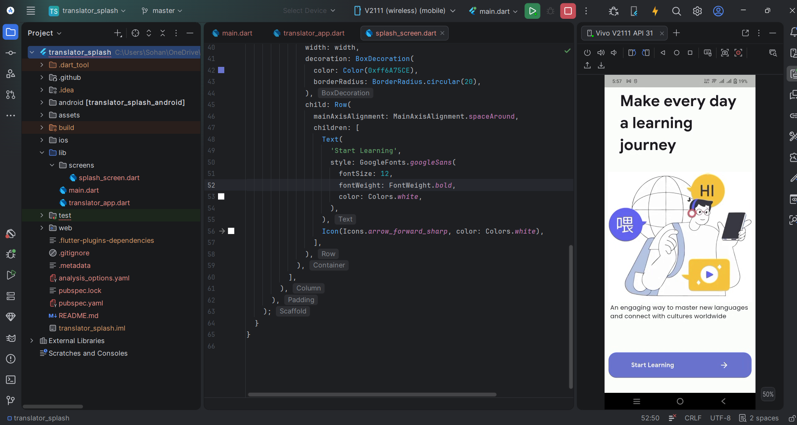

# Translator Splash

A beautiful and engaging splash screen for a Language Learning / Translator application built with Flutter.

## Features

- **Modern Typography**: Uses `Google Fonts` (Google Sans and Poppins) for a professional look.
- **Responsive Design**: Utilizes `MediaQuery` to ensure the layout looks great on various screen sizes.
- **Interactive UI**: Includes a "Start Learning" call-to-action button with a clean design.
- **Visual Appeal**: Features high-quality illustrations to engage users from the first launch.

## Project Structure

- `lib/screens/splash_screen.dart`: Contains the main UI for the splash screen.
- `lib/translator_app.dart`: The main app widget configuration.
- `assets/`: Contains images and resources used in the app.

## Preview

## Getting Started

To run this project:

1. Ensure you have Flutter installed.
2. Clone the repository.
3. Run `flutter pub get` to install dependencies.
4. Run `flutter run` to start the application.

---
Developed as part of the bdApps BootCamp Assignment.
