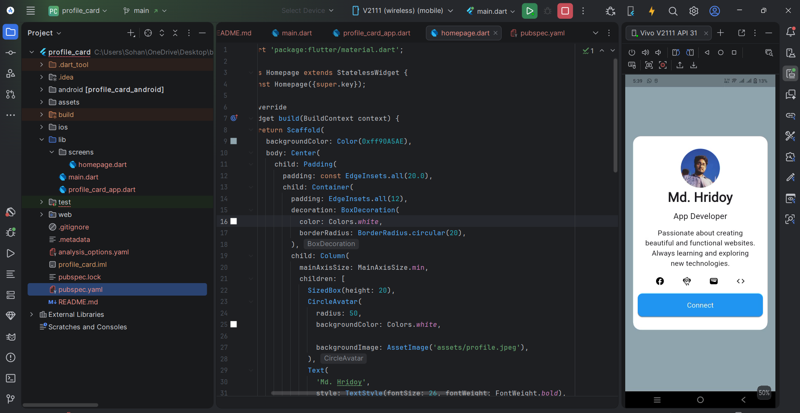

# Profile Card App

A Flutter project that displays a personal profile card with contact information and social links.

## Features
- Profile picture
- Personal information (Name, Role, Description)
- Social media icons
- "Connect" button with a snackbar message

## Preview


## Getting Started

To get a local copy up and running follow these simple steps.

### Prerequisites
- [Flutter SDK](https://docs.flutter.dev/get-started/install)

### Installation
1. Clone the repo
   ```sh
   git clone https://github.com/your_username/profile_card.git
   ```
2. Install dependencies
   ```sh
   flutter pub get
   ```
3. Run the app
   ```sh
   flutter run
   ```
