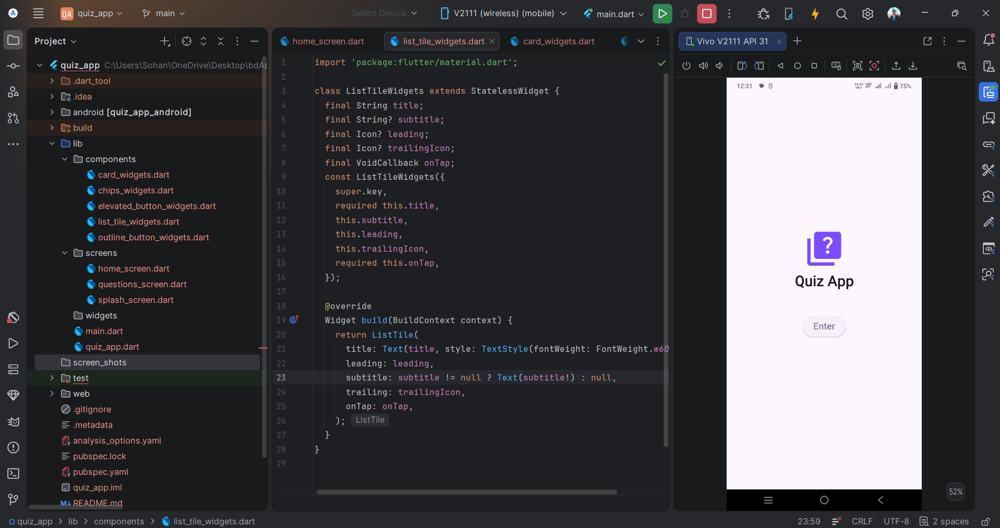
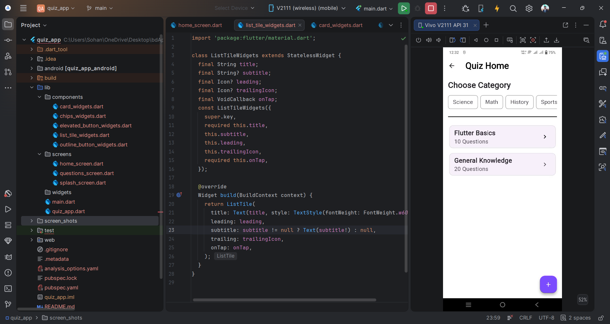
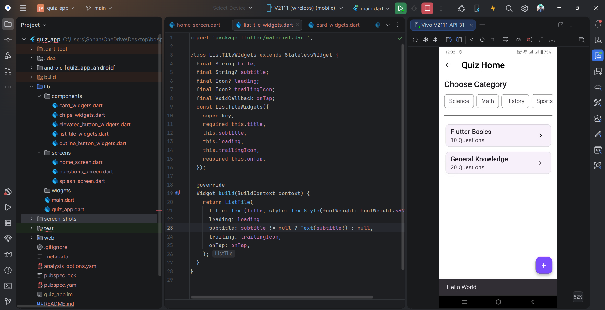
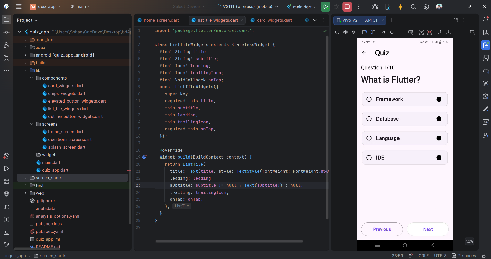

# Quiz App

A beautiful and interactive Flutter-based Quiz Application designed to provide a seamless user experience for testing knowledge across various topics.

## Features

- **Splash Screen**: Engaging entrance to the application.
- **Home Screen**: Browse through different quiz categories and available sets.
- **Categories**: Select from Science, Math, History, Sports, and more.
- **Quiz Interface**: User-friendly layout for answering questions with clear options.
- **Custom UI Components**: Highly reusable widgets for consistent design across the app.

## Screenshots

| Splash Screen | Home Screen | Question Screen | Results/Other |
|:---:|:---:|:---:|:---:|
|  |  |  |  |

## Technologies Used

- **Flutter**: For cross-platform UI development.
- **Dart**: Programming language used for logic and UI.

## Getting Started

### Prerequisites

- [Flutter SDK](https://docs.flutter.dev/get-started/install)
- [Dart SDK](https://dart.dev/get-dart)

### Installation

1.  **Clone the repository**:
    ```bash
    git clone <repository-url>
    ```
2.  **Navigate to the project directory**:
    ```bash
    cd quiz_app
    ```
3.  **Install dependencies**:
    ```bash
    flutter pub get
    ```
4.  **Run the application**:
    ```bash
    flutter run
    ```

## Project Structure

- `lib/screens/`: Main application screens (Splash, Home, Questions).
- `lib/components/`: Reusable UI widgets like buttons, cards, and list tiles.
- `screen_shots/`: Visual representation of the app's UI.
