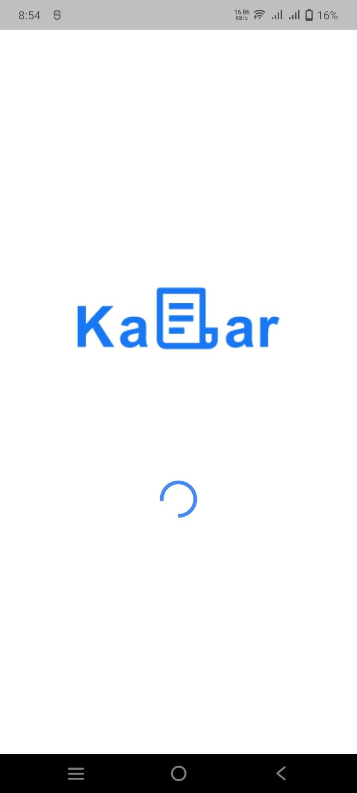
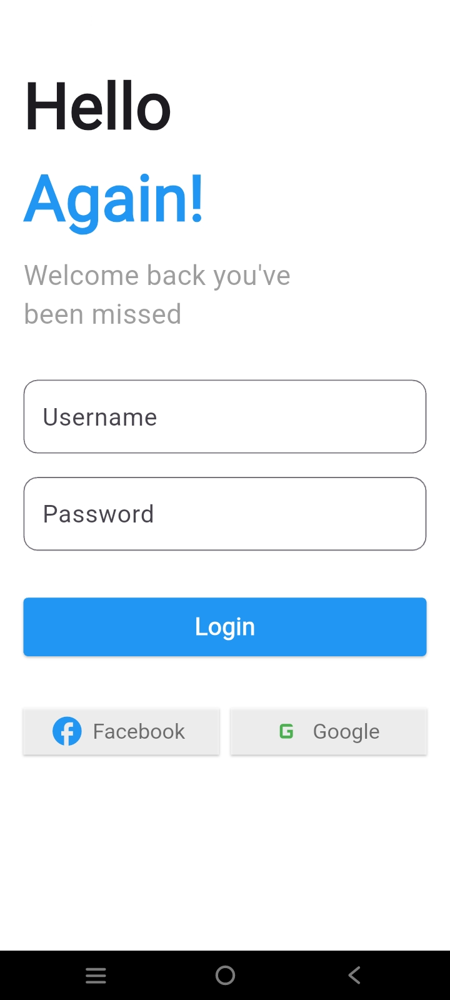

# Login App with Provider, GoRouter, and Shared Preferences

A Flutter application demonstrating a robust authentication flow. This project showcases how to manage app state using `Provider`, handle navigation with `GoRouter`, and persist user login sessions using `Shared Preferences`.

## 🚀 Features

- **Splash Screen:** Smooth initial loading transition.
- **Login Screen:** User authentication interface with social login UI and form fields.
- **Home Screen:** Secure dashboard accessible after successful authentication.
- **Persistent Login:** Session persistence using `Shared Preferences`.
- **State Management:** Reactive UI updates using the `Provider` pattern.
- **Declarative Routing:** Clean navigation stack management with `GoRouter`.

## 🛠️ Built With

- **Flutter**: UI toolkit for building natively compiled applications.
- **Provider**: A wrapper around InheritedWidget to make state management easier.
- **GoRouter**: A declarative routing package for Flutter.
- **Shared Preferences**: For storing simple data locally.

## 📸 Screenshots

<p align="center">
  
  
  
</p>

## 🎥 Demo Video

You can find the demo video of the application here:
[Download/Watch Demo Video](screenshots/demo_live_app.mp4)

## 🏁 Getting Started

### Prerequisites

- [Flutter SDK](https://docs.flutter.dev/get-started/install)
- [Android Studio](https://developer.android.com/studio) / [VS Code](https://code.visualstudio.com/)

### Installation

1. Clone the repository:
   ```bash
   git clone https://github.com/your-username/login_provider_shared_pref_go.git
   ```

2. Navigate to the folder:
   ```bash
   cd login_provider_shared_pref_go
   ```

3. Install dependencies:
   ```bash
   flutter pub get
   ```

4. Run the application:
   ```bash
   flutter run
   ```

## 📂 Project Structure

- `lib/provider/`: Authentication logic and state.
- `lib/router/`: Route definitions and navigation logic.
- `lib/screens/`: App screens (Splash, Login, Home).
- `lib/shared_pref_manager/`: Local storage handling.
- `lib/widgets/`: Custom reusable widgets (Buttons, TextFields, etc.).
